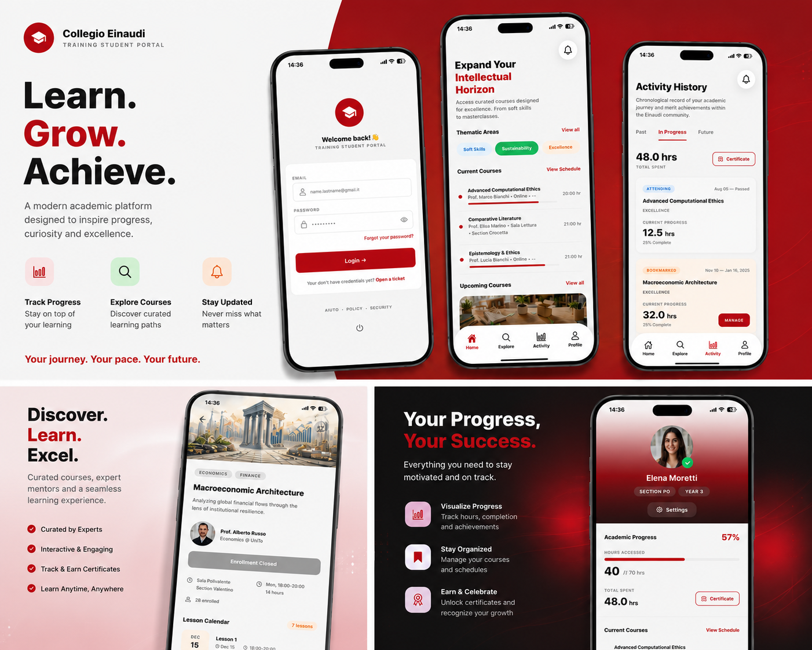

# Collegio Einaudi App



Mobile application prototype designed to improve the student experience by providing course discovery, activity tracking, and personalized navigation in a clean and intuitive interface.

---

## 📱 Overview

This project is a **React Native (Expo) mobile app** that simulates a digital platform for students to explore courses, manage their activity, and interact with academic content.

The app focuses on **user experience, navigation design, and modular mobile architecture**, making it a strong example of frontend/mobile development.

---

## 🚀 Features

* 🔐 Authentication flow (login screen)
* 🏠 Home dashboard
* 🔎 Course search and filtering
* 📚 Course detail pages
* 🔔 Notifications system (UI)
* 📊 Activity tracking section
* 👤 User profile screen
* ⚙️ Settings page
* 📱 Bottom tab navigation

---

## 🛠️ Tech Stack

* **Framework:** React Native (Expo)
* **Language:** JavaScript
* **Navigation:** React Navigation (tab-based UI)
* **Architecture:** Component-based structure
* **Data:** Local mock data (no backend integration)

---

## 🧱 Project Structure

```
CollegioEinaudi/
├── components/       # Reusable UI components
├── screens/          # App screens (Home, Search, Profile, etc.)
├── data/             # Mock data
├── assets/           # Images and static files
├── App.js            # Entry point
```

---

## ▶️ Getting Started

1. Clone the repository:

```bash
git clone https://github.com/YOUR-USERNAME/collegio-einaudi-app.git
cd collegio-einaudi-app
```

2. Install dependencies:

```bash
npm install
```

3. Run the app:

```bash
npx expo start
```

---

## 📸 Screenshots

TO BE ADDED

---

## 🎯 Purpose of the Project

This project was developed to:

* Practice **mobile UI/UX design** and **mobile front-end development**
* Build a **multi-screen navigation system**
* Structure a scalable **React Native project**
* Simulate a real-world case-scenario

---

## 📌 Future Improvements

* Backend integration (API + database)
* Real authentication system
* Persistent user data
* Push notifications
* Performance optimization

---

## 👤 Author

Gaia Lecis
GitHub: https://github.com/gaialecis18

---

## 📄 License

This project is for personal and portfolio purposes.

